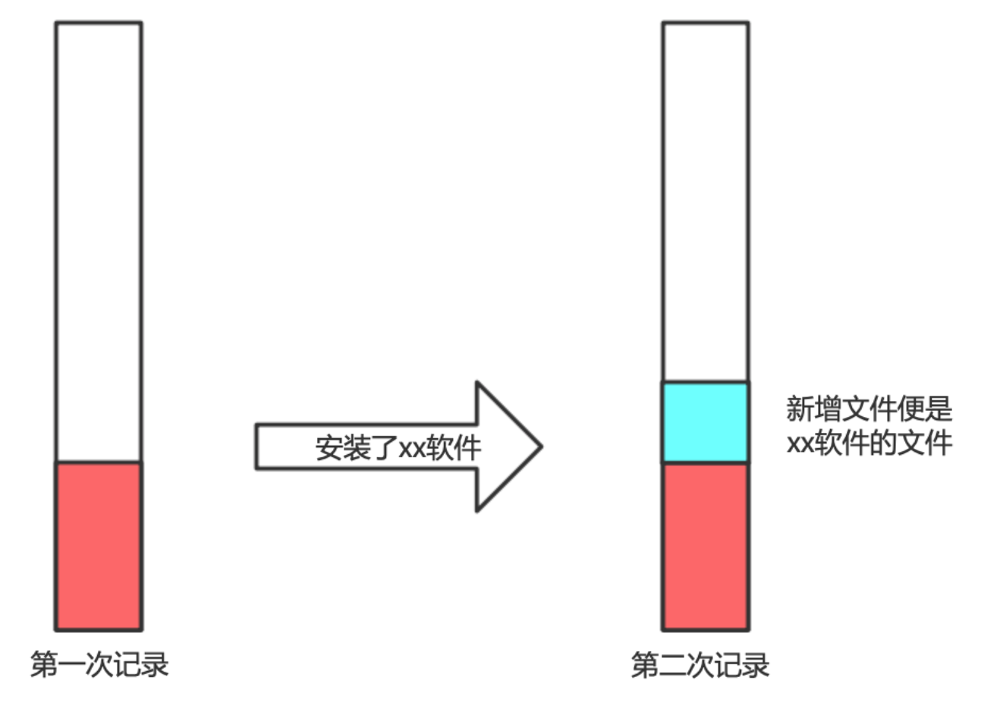
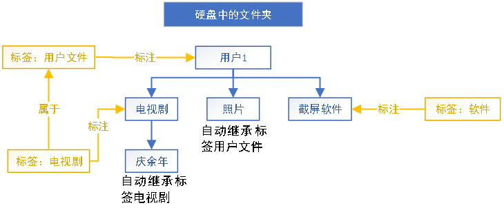

## 存储空间分析软件

### 功能简介
主要工作方式为：通过记录存储空间的变化，对存贮空间就中的文件夹打标签，从而整理存储中间中各个软件的占用空间。
从而方便在电脑存储空间不足时对空间进行清理。

如图所示：  
可以通过比对两个记录之间的变化，确定新增软件所使用的文件夹，然后将这个文件夹打上对应的标签。
最终可以通过计算每个标签对应文件夹的大小，从而统计个软件的占用空间。

优点：可以精确统计计算机中所有软件，系统文件以及个人的占用空间，即便软件有多个安装位置。  
缺点：需要养成频繁记录存储空间并打标签的习惯。

### 记录功能

记录功能也是本软件的核心功能。为了缩短记录所花费的时间，统计减少记录的占用空间，本软件使用了增量记录的逻辑。
即，仅在第一次记录时，记录全盘所有文件夹。后续记录仅统计变化的文件夹。
预计第一次记录，可能会花费10分钟到30分钟的时间。而后续记录可能仅花费不到3分钟。
具体耗时需要看两次记录见存储空间的变化量。

在存储的数据结构设计上，考虑到记录过程可能会消耗较长的时间，有做特殊的处理。
即便存储过程被打断，也不会造成数据结构的异常。且该记录数据结构支持删除功能，删除单个记录
并不影响整体数据结构的完整性。可以在标注文件夹后，删除不需要的记录以节省其对存储空间的占用。
预计在正常使用的过程中，仅会占用100MB到200MB的存储空间。

### 对比功能

通过该页面可以非常快捷的对比两个记录之间的区别。其中红色为被删除的文件夹，蓝色是占用空间发生了变化的文件夹，
绿色是新增的文件夹，可以通过右边的编辑标签按键为文件夹打标签。

### 编辑标签功能

该软件总共支持三层标签。每一个标签都可以标注多个多个文件夹。可以通过右键新增，修改和删除标签。
如图所示：这是安装Radar软件后，通过比对记录，标注的Rader软件所使用的文件夹。

### 编辑记录功能

支持记录查看和删除功能，注意：在删除记录时请勿强制关闭软件，否则会导致时间结构错误。

### 查看记录功能

该功能尚未完成。  
可以查看每个标签下对应文件夹的占用空间，并支持双击进入，查看该标签下子标签的占用空间。  
标签统计方式如图所示，在统计用户文件标签的占用空间时，不会统计其中切屏软件的占用空间。

### 数据结构-记录
后续补充
